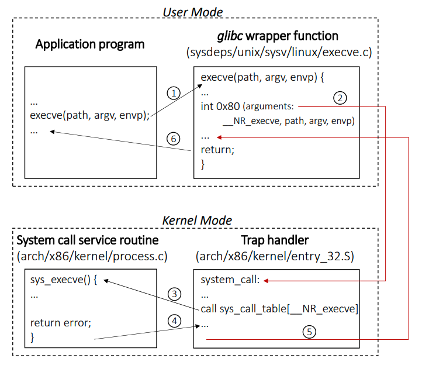

+++
title = "Lezione 1.A - Concetti fondamentali: Processi e Programmi"
slug = "1-a-concetti-fondamentali"
date = 2021-10-29
syscall = [ "perror", "strerror", "errExit"]
description = "Introduzione ai processi e programmi, memoria, errori, file descriptor e pagine del manuale."
author = "SeekBytes"
+++

## Processi e programmi


Un processo è un'istanza di un programma in esecuzione.



Un programma è un file binario che contiene una serie di informazioni che descrive come strutturare il processo a tempo di esecuzione.


Dal punto di vista del kernel, un processo consiste di:
* memoria user-space (nello spazio utente) contenente il codice del programma,
* le variabili utilizzate nel codice, e
* una serie di strutture dati del kernel che mantengono informazioni riguardo lo stato del processo (esempio: tabelle delle pagine, tabella dei file aperti, segnali da inviare, l'utilizzo delle risorse del processo e i limiti..)

## Configurazione della memoria di un processo

Tipica configurazione dello spazio di RAM di un processo:

* il codice di sola lettura contenente le istruzioni macchina sono memorizzate in un segmento chiamato **text**
* il segmento di dati inizializzati (contiene le variabili statiche e globali) si chiama **data**
* il segmento che contiene variabili statiche e globali **NON** ancora inizializzate si chiama **BSS**
* il segmento che contiene le variabile allocate dinamicamente si chiama heap
* lo stack contiene ogni funzione chiamata, i suoi argomenti e tutte le variabili locali



#include <stdlib.h>
// Declared global variables
char buffer[10]; // <- (bss)
int primes [] = {2, 3, 5, 7}; // <- (data)
// Function implementation
void method(int *a) { // <- (stack)
	int i; // <- (stack)
	for (i = 0; i < 10; ++i)
		a[i] = i;
}
// Program entry point
int main (int argc, char *argv[]) { // <- (stack)
	static int key = 123; // <- (data)
	int *p; // <- (stack)
	p = malloc(10 * sizeof(int)); // <- (heap)
	method(p);
	free(p);
	return 0;
}



Puoi vedere le dimensioni dei segmenti tramite il comando `size`.




int main (int argc, char \*argv[]) {
	char *string = "ciao";
	string[0] = ‘C‘;
	printf("%s\n", string);
	return 0;
}


Perché ho un segmentation error nel primo esempio? Perché alla riga XX sto tentando di sovrascrivere una struttura dati costante che verrà posizionata nel segmento .text (di sola lettura!).






int main (int argc, char *argv[]) {
	char string[] = "ciao";
	string[0] = ‘C‘;
	printf("%s\n", string);
	return 0;
}




## Panoramica della File Descriptor Table

Per ogni processo generato, il Kernel mantiene una tabella (file descriptor table). Ogni entry della tabella è un file descriptor, ovvero un numero positivo che rappresenta una risorsa input/output aperto dal processo (esempio: file, pipe, socket). 

Per convenzione, esistono **sempre** tre file descrittori in un nuovo processo.

File descriptor | Descrizione | nome POSIX
-- | -- | --
0 | standard input | `STDIN_FILENO`
1 | standard output | `STDOUT_FILENO`
2 | standard error | `STDERR_FILENO`

Più dettagli sono contenuto nel capitolo "File system".

## System Call

Tipica architettura del sistema operativo:


Una system call è una entry point controllata che permette ad un processo di richiedere un servizio al Kernel. Per esempio, i servizi che il kernel mette a disposizione includono: creazione di un nuovo processo, esecuzione di operazioni I/O, creazione di una pipe per la comunicazione tra più processi.

La pagina di manuale `syscalls(2)` include la lista delle system calls disponibili per Linux. I dettagli tecnici sono disponibili per ogni system call tramite il comando `man` (vedi sezione "manuale").

Dal punto di vista della programmazione, invocare una system calls è molto simile a chiamare una funzione C. Tuttavia, ciò che avviene dietro quell'invocazione è molto differente rispetto ad una chiamata di funzione. Di seguito i passi per l'esecuzione di una system call.



1. l'applicazione chiama una system call invocando una funzione di "wrapper" nella libreria C
2. la funzione wrapper: copia gli argomenti della system call dallo stack a registri specifici della CPU e copia il numero di system call nel registro `%eax`. (Ogni system call ha associato un nome dato dalla libreria standard C e un numero univoco) Infine, il wrapper chiama l'interrupt per cambiare modalità da "utente" a "kernel mode" (`int 0x80`)
3. il kernel esegue la routine per le system call: salva i valori dei registri nello stack del kernel, controlla la validità del numero di sistem call e invoca la "vera" system call (system call service routine)
4. La service routine esegue il task richiesto e il risultato è ritornato alla routine
5. La routine ripristina i valori dei registri dallo stack del kernel e pone il risultato della system call sullo stack. Simultaneamente, la routine cambia modalità da kernel a user mode e ritorna all'esecuzione della funzione wrapper
6. Se il valore di ritorno della chiamata di sistema indica un errore, allora la funzione di wrapper imposta una variabile globale chiamata `errno`. Successivamente, la funzione di wrapper ritorna al chiamante un valore intero indicando il successo o il fallimento della system call. 

Per convenzione, il numero negativo -1 o il puntatore `NULL` indica un errore all'applicazione chiamante.

## Gestire gli errori

La sezione `ERRORS` nelle pagine del manuale di ogni system call documenta il possibile valore di ritorno indicante un errore. Abitualmente, una system call notifica un errore ritornando -1 come risultato.

Quando una system call fallisce, la variabile globale intera errno è impostata ad un valore positivo che identifica l'errore avvenuto. Includere il file header `<errno.h>` fornisce una dichiarazione di errno, così come un insieme di costanti per i vari numeri di errore.


 
#include <errno.h>
...
// system call to open a file
fd = open(pathname, flags, mode); // BEGIN code handling errors.
if (fd == -1) {
	if (errno == EACCES) {
		// Handling not allowed access to the file
	} else {
		// Some other error occurred
	}
}
// END code handling errors



Alcune system call (ad esempio `getpriority`) possono ritornare -1 se hanno successo. Per determinare se un errore accade veramente in questi casi, dobbiamo impostare la variabile `errno` a 0 prima di chiamare qualsiasi system call. Se l'invocazione ritorna -1 e `errno` non è zero, allora è accaduto un errore.



#include <sys/resource.h>
// Reset the errno variable to 0
errno = 0;
// System call getpriority gets the nice value of a process
nice = getpriority(which, who);
if ((nice == -1) && (errno != 0)) {
	// Handling getpriority errors
}




### perror

La funzione `perror` stampa nello standard error la stringa `msg` seguita da un messaggio che descrive l'ultimo errore incontrato durante l'ultima invocazione della system call.


void perror(const char *msg);






#include <stdio.h> ...
// System call to open a file.
fd = open(pathname, flags, mode);
if (fd == -1) { perror("<Open>");
	// System call to kill the current process.
	exit(EXIT_FAILURE);
} ...


Output di esempio:
`<Open>: No such file or directory`


### strerror

La funzione `strerror()` ritorna la stringa di errore corrispondente al numero di errore errnum passato come parametro.


#include <string.h>
char *strerror(int errnum);


La stringa ritornata potrebbe essere sovrascritta da una chiamata a strerror(). Se errnum non è riconosciuto come numero, strerror() ritorna una stringa della forma "Unkown error nun."

Esempio dell'utilizzo di strerror per stampare un messaggio di errore descrivendolo.




#include <stdio.h> ...
// System call to open a file
fd = open(path, flags, mode);
if (fd == -1) {
printf("Error opening (%s):\n\t%s\n", path, strerror(errno));
// System call to kill the current process
exit(EXIT_FAILURE);
} ...


Output di esempio:

```
Error opening (myFile.txt):
No such file or directory
```


### errExit

In queste slide, la funzione `errExit` viene utilizzata come una scorciatoia per stampare un messaggio e terminare il processo. 


void errExit(const char *msg) {
	perror(msg); 
	exit(EXIT_FAILURE);
}


**NON FA PARTE DELA LIBRERIA STANDARD DI C!**

### Comando strace

Il comando strace permette di vedere quali system call un processo sta utilizzando. Nella sua forma più semplice, viene utilizzato così

```
strace command arg...
```

## Tipi di dati del kernel

Anche in ogni implementazione su Linux, i tipi di dati utilizzati per rappresentare le informazioni possono differire da ogni rilascio. Per esempio: user e group id che venivano rappresentati da 16 bit e poi da 32 bit.

Per evitare problemi di portabilità, vennero definiti alcuni tipi di dati standard. Ogni tipo viene definito tramite `typedef` di C. Molti di questi tipi di dati sono nomi che finiscono con la \_t per type. La maggior parte sono dichiarate nel file <sys/types.h>

Questa tabella presenta alcuni tipi di dati che andremo ad utilizzare in questo corso.

Tipo di dato | Reale | Descrizione
-- | -- | --
`ssize_t` | intero con segno | per indicare la conta dei byte o per indicare errori
`size_t` | intero positivo | per indicare la conta dei byte
`off_t` | intero con segno | per indicare l'offset del file
`mode_t` | intero | permessi dei file e il tipo
`pid_t` | intero con segno | processo, gruppo di processi o l'id della sezione
`uid_t` | intero | identificativo numerico per l'utente
`gid_t` | intero | identificativo numerico per il gruppo
`key_t` | tipo aritmetico | il tipo di IPC System V
`time_t` | intero o numero floating point | time in secondi dall'Epoch
`msgqnum_t` | intero senza segno | conta dei messaggi in una coda
`msglen_t` | intero positivo | numero che indica quanti byte sono ammessi in un messaggio
`shamatt_t` | intero positivo | conta quanti attacchi ci sono per la memoria condivisa

## Pagine del manuale

Le pagine del manuale sono un insieme di pagine che spiegano ogni comando disponibile sul vostro sistema, incluso ciò che fanno, le specifiche di come eseguirli e quali argomenti della linea di comando accettano. Le pagine di manuale sono accessibili tramite il comando man. Esempio:
man <command>

Una pagina di manuale è solitamente divisa in sezioni numerate:
1. Comandi utente
2. Documentazione sulle chiamate di sistema
3. Documentazione sulle funzioni di libreria fornite dalla libreria C standard
4. Documentazione sui dispositivi
5. Formati di file e convenzioni

Come ottenere la documentazione di...
* cd comando bash: `man cd` (o man 1 cd) open chiamata di sistema: man 2 open
* funzione C strlen: `man 3 strlen`
* dispositivi disco fisso: `man 4 hd`
* formato file fstab: `man 5 fstab`

Utilità:
Il comando `man -k <str>` cerca le descrizioni brevi e i nomi delle pagine del manuale per la parola chiave str come espressione regolare.