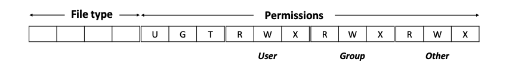

+++
title = "Lezione 1.B - Concetti fondamentali: File System"
slug = "1-b-file-system"
date = 2021-10-29
description = "I file: open, write su file e su directory. Attributi di un file e permessi di file/cartelle."
author = "SeekBytes"
syscalls = ["open", "read", "write", "lseek", "close", "stat", "lstat", "fstat", "access", "chmod", "fchmod", "mkdir", "rmdir", "opendir", "closedir", "readdir"]
+++

## File

### Apertura file (Open)

La system call open apre un file esistente. In alternativa, può creare e quindi aprire un nuovo file.


#include <sys/stat.h>
#include <fcntl.h>

// Ritorna il file descriptor altrimenti -1 in caso di fallimento
int open(const char *pathname, int flags, .../*mode_t mode */);


Se ha successo, ritorna il file descriptor che è usato per riferirsi al file in tutte le system call successivi. Il file da essere aperto / creato è identificato dall'argomento pathname.

L'argomento `flags` è una bit mask di una o più costanti che specifica in che modalità aprire il file.

FLAG | DESCRIZIONE
-- | --
`O_RDONLY` | Aperto in sola **lettura**
`O_WRONLY` | Aperto in sola **scrittura**
`O_RDWR` | Aperto sia in scrittura che in lettura
`O_TRUNC` | Tronca il file esistente 
`O_APPEND` | Tutto ciò che viene scritto è dopo il contenuto del file
`O_CREAT` | Crea un file se non esiste già
`O_EXCL` | Utilizzata insieme alla O_CREAT, forza la creazione del file

Quando un nuovo file viene creato, allora anche il terzo argomento mode viene considerato.

L'argomento mode è una bitmast di uno o dei seguenti valori che specificano i permessi per il nuovo file.

FLAG | DESCRIZIONE
-- | --
`S_IRWXU` | l'utente ha permessi di lettura, scrittura ed esecuzione
`S_IRUSR` | l'utente ha permessi di lettura
`S_IWUSR` | l'utente ha permessi di scrittura
`S_IXUSR` | l'utente ha permessi di esecuzione
`S_IRWXG` | il gruppo ha permessi di lettura, scrittura ed esecuzione
`S_IRGRP` | il gruppo ha permessi di lettura
`S_IWGRP` | il gruppo ha permessi di scrittura
`S_IXGRP` | il gruppo ha permessi di esecuzione
`S_IRWXO` | ...

### Umask

La maschera per la creazione di file utente è un attributo del processo che specifica quali permessi dovrebbero essere sempre disattivati quando nuovi file sono creati da un processo. Nella maggior parte delle shell, il valore di default è 022.

I permessi assegnati ad un nuovo file sono: `mode & ~umask` ovvero `mode AND (NOT mask)`. Puoi gestire umask tramite la shell utilizzando il comando `umask`.

{{
}}

Requested file perms: rw-rw---- (<- this is what we asked)
Process umask: ----w--w- (<- this is what we are denied)
Actual file perms: rw-r----- (<- So, this is what we get)

{{
}}

{{
}}

int fd;
// Open existing file for only writing.
fd = open("myfile", O_WRONLY);
// Open new or existing file for reading/writing, truncating
// to zero bytes; file permissions read+write only for owner.
fd = open("myfile1", O_RDWR | O_CREAT | O_TRUNC, S_IRUSR | S_IWUSR);
// Create and open a new file for reading/writing; file
// permissions read+write only for owner.
fd = open("myfile2", O_RDWR | O_CREAT | O_EXCL, S_IRUSR | S_IWUSR);

{{
}}

### Read

La system call read legge dati da un file descriptor. Ritorna il numero di byte letti oppure -1 se fallisce. L'argomento count specifica il massimo numero di byte da leggere dal file descriptor. L'argomento buf è l'indirizzo di memoria in cui le informazioni lette vengono memorizzate.


#include <unistd.h>

// Ritorna il numero di byte letti, -1 in caso di errori
ssize_t read(int fd, void *buf, size_t count);


{{
}}

// Open existing file for reading.
int fd = open("myfile", O_RDONLY);
if (fd == -1)
	errExit("open");

// A MAX_READ bytes buffer.
char buffer[MAX_READ + 1];

// Reading up to MAX_READ bytes from myfile.
ssize_t numRead = read(fd, buffer, MAX_READ);
if (numRead == -1)
	errExit("read");


Nota: con un file, il valore di ritorno zero indica che si è raggiunto l'End-of-File.
{{
}}

{{
}}

// A MAX_READ bytes buffer.
char buffer[MAX_READ + 1];
// Reading up to MAX_READ bytes from STDIN.
ssize_t numRead = read(STDIN_FILENO, buffer, MAX_READ);
if (numRead == -1)
	errExit("read");
buffer[numRead] = ’\0’;
printf("Input data: %s\n", buffer);


Nota: con il terminale, la system call legge i caratteri fino a che non incontra la newline `\n`.
{{
}}

### Write

La system call write scrive dati su un file descriptor. Ritorna il numero di caratteri scritti o -1 se fallisce. L'argomento count specifica il numero di byte che il buffer buf contiene e che deve essere scritto sul file descriptor fd.


#include <unistd.h>

// Ritorna il numero di byte scritti, -1 in caso di errori.
ssize_t write(int fd, void *buf, size_t count);


{{
}}

// Open existing file for writing.
int fd = open("myfile", O_WRONLY);
if (fd == -1)
    errExit("open");
// A buffer collecting the string.
char buffer[] = "Ciao Mondo";
// Writing up to sizeof(buffer) bytes into myfile.
ssize_t numWrite = write(fd, buffer, sizeof(buffer));
if (numWrite != sizeof(buffer))
errExit("write");

{{
}}

{{
}}

// A buffer collecting a string.
char buffer[] = "Ciao Mondo";
// Writing up tp sizeof(buffer) bytes on STDOUT.
ssize_t numWrite = write(STDOUT_FILENO, buffer, sizeof(buffer));
if (numWrite != sizeof(buffer))
    errExit("write");

{{
}}

### Lseek


#include <unistd.h>

// Ritorna la location dell'offset, -1 in caso di errore.
off_t lseek(int fd, off_t offset, int whence);


Per ogni file aperto, il kernel salva un *file offset* che è la posizione da dove la prossima lettura o scrittura inizierà. La system call `lseek` aggiusta la posizione dell'offset di un file aperto.

L'argomento fd specifica il file descriptor del file aperto, offset specifica un valore in byte, mentre whence indica il punto di partenza da cui l'offset deve essere interpretato.

{{
}}
// first byte of the file.
off_t current = lseek(fd1, 0, SEEK_SET);
// last byte of the file.
off_t current = lseek(fd2, -1, SEEK_END);
// 10th byte past the current offset location of the file.
off_t current = lseek(fd3, -10, SEEK_CUR);
// 10th byte after the current offset location of the file.
off_t current = lseek(fd4, 10, SEEK_CUR);
{{
}}

### Close

La system call close chiude un file descriptor aperto. Anche se il sistema operativo già chiude tutti i file descriptor quando il processo è terminato, è comunque buona pratica chiudere i file descriptor non necessari.


#include <unistd.h>
// Returns 0 on success, or -1 on error.
int close(int fd);


### Unlink

La system call unlink permette di rimuovere un collegamento e se il collegamento è direttamente il file, allora lo rimuove. Unlink non può rimuovere una cartella (per questo vedi rmdir).


#include <unistd.h>
// Returns 0 on success, or -1 on error
int unlink(const char *pathname);


{{
}}

// Create a new file named myFile.
int fd = open("myFile", O_CREAT | O_WRONLY);
// ... only writes as myFile is open in write-only
// Close the file descriptor fd
close(fd);
// Unlink (remove) myFile
unlink("myFile");

{{
}}

### Attributi

Le successive tre system call (stat, lstat e fstat) ritornano informazioni riguardo un file (compresa una cartella – su Linix una cartella è un file).


#include <sys/stat.h>

// Return 0 on success or -1 on error.
int stat(const char *pathname, struct stat *statbuf);
int lstat(const char *pathname, struct stat *statbuf);
int fstat(int fd, struct stat *statbuf);


#### stat

La system call stat ritorna informazioni riguardo ad un file.

#### lstat

La system call lstat ritorna informazioni riguardo ad un collegamento ad un file.

#### fstat

Fstat è simile a stat solo che l'accesso al file non è più per nome ma per file descriptor.

Tutte queste system call ritornano una struttura `stat` nel buffer puntato da statbuf. La struttura ha la seguente forma:


struct stat {
	dev_t st_dev; // IDs of device on which file resides.
	ino_t st_ino; // I-node number of file. 
	mode_t st_mode; // File type and permissions.
	nlink_t st_nlink; // Number of (hard) links to file. 
	uid_t st_uid; // User ID of file owner.
	gid_t st_gid; // Group ID of file owner.
	dev_t st_rdev; // IDs for device special files.
	off_t st_size; // Total file size (bytes).
	blksize_t st_blksize; // Optimal block size for I/O (bytes).
	blkcnt_t st_blocks; // Number of (512B) blocks allocated. 
	time_t st_atime; // Time of last file access.
	time_t st_mtime; // Time of last file modification. 
	time_t st_ctime; // Time of last status change.
};


Spiegazione di alcuni campi:

* `st_dev` (anche chiamato device id): identifica il dispositivo in cui il file risiede;
* `st_ino`: contiene il numero dell'i-node del file. La combinazione del device id e st_ino identifica in modo univoco un file
* `st_uid`: id dell'utente a cui il file appartiene
* `st_gid`: id del gruppo a cui il file appartiene
* `st_nlink` (conta dei collegamenti): numero dei collegamenti al file
* `st_atime`, `st_mtime`, `st_ctime`: contengono rispettivamente il tempo dell'ultimo accesso, dell'ultima modifica e dell'ultima modifica alle informazioni dell'i-node nel formato timestamp

**Dimensione dei file, blocchi allocati e dimensione ottimale dei blocchi I/O**: 
Per i file regolari, il campo `st_size` è la dimensione totale del file in byte. Per un collegamento simbolico, questo campo contiene la lunghezza (in byte) del percorso indicato dal collegamento.
Il campo `st_blocks` indica il numero di blocchi effettivamente assegnati al file in unità di blocco da 512 byte (potrebbe essere più piccolo di quanto ci si aspetta dalla dimensione st corrispondente se il file contiene dei buchi).
La `st_blksize` è la dimensione ottimale del blocco (in byte) per l'I/O sui file su questo file system. L'I/O in blocchi più piccoli di questa dimensione è meno efficiente. Un tipico valore restituito in `st_blksize` è 4096.

#### Permessi dei file e tipo di file 

Il campo st mode è una maschera di bit che serve al doppio scopo di identificare il tipo di file e specificare i permessi del file. 

Il tipo di file può essere estratto da questo campo tramite AND (&) con la costante S_IFMT, e poi confrontando il risultato con una serie di costanti. Poiché questa è un'operazione comune, vengono fornite delle macro standard.

Costante | Macro di test | Tipo di file
-- | -- | --
`S_IFREG` | `S_ISREG()` | File normale
`S_IFDIR` | `S_ISDIR()` | Cartella
`S_IFCHR` | `S_ISCHR()` | Character Device
`S_IFBLK` | `S_ISBLK()` | Block device
`S_IFIFO` | `S_ISFIFO()` | FIFO oppure PIPE
`S_IFSOCK` | `S_ISSOCK()` | Socket
`S_IFLNK` | `S_ISLNK()`  | Collegamento

{{
}}

char pathname[] = "/tmp/file.txt";
struct stat statbuf;
// Getting the attributes of /tmp/file.txt
if (stat(pathname, &statbuf) == -1)
errExit("stat");
// Checking if /tmp/file.txt is a regular file
if ((statbuf.st_mode & S_IFMT) == S_IFREG)
printf("regular file!\n");
// Equivalently, checking if /tmp/file.txt is a // regular file by S_ISREG macro.
if (S_ISREG(statbuf.st_mode))
    printf("regular file!\n");

{{
}}

I bit nominati `U` e G sono utilizzati per gli eseguibili.

* set-user-ID: se è impostato, allora l'effective user ID del processo è uguale a quello del proprietario dell'eseguibile
* set-group-ID: se impostato, allora l'effective group ID del processo è uguale a quello del proprietario dell'eseguibile

Il bit nominato `T`, chimato Sticky-bit, agisce come flag di cancellazione limitata per le directory.

Impostare questo bit su una directory significa che un processo senza privilegi può scollegare (`unlink()`, `rmdir()`) e rinominare (`rename()`) i file nella directory solo se ha il permesso di scrittura sulla directory e possiede il file o la directory.

I restanti 9 bit formano la maschera che definisce i permessi che sono concessi alle varie categorie di utenti che accedono al file. La maschera dei permessi del file divide il "mondo" in tre categorie: 

* Proprietario: i permessi concessi al proprietario del file.
* Gruppo: I permessi concessi agli utenti che sono membri del gruppo del file.
* Altro: I permessi concessi a tutti gli altri.

Ad ogni categoria di utenti possono essere concessi tre permessi:
* Lettura: Il contenuto del file può essere letto. 
* Scrittura: Il contenuto del file può essere modificato. 
* Esecuzione: Il file può essere eseguito.

Le cartelle hanno lo stesso schema di permessi dei file. Tuttavia, i tre permessi sono interpretati in modo diverso:
* Lettura: Il contenuto (cioè l'elenco dei nomi dei file) della directory può essere elencato
* Scrittura: I file possono essere creati e rimossi dalla directory
* Esecuzione: Si può accedere ai file all'interno della directory.

Quando si accede a un file, il permesso di esecuzione è richiesto su tutte le directory elencate nel percorso.

Il file header `<sys/stat.h>` definisce delle costanti che possono essere controllate [tramite una AND (&)] con il `st_mode` della struttura stat per controllare se particolari bit di permesso sono impostati.

{{
}}

char pathname[] = "/tmp/file.txt";
struct stat statbuf;
// Getting the attributes for the executable /tmp/a.out
if (stat(pathname, &statbuf) == -1)
errExit("stat");
// printing out the user’s permissions
printf("user’s permissions: %c%c%c\n",
(statbuf.st_mode & S_IRUSR)? ’r’ : ’-’,
(statbuf.st_mode & S_IWUSR)? ’w’ : ’-’,
(statbuf.st_mode & S_IXUSR)? ’x’ : ’-’);

{{
}}

#### access

La chiamata di sistema access verifica l'accessibilità del file specificato nel pathname in base ai reali ID utente e gruppo di un processo. Se il pathname è un collegamento simbolico, access lo dereferenzia. L'argomento mode è una maschera di bit composta da una o più delle seguenti costanti:


#include <unistd.h>
// Returns 0 if all permissions are granted, otherwise -1
int access(const char *pathname, int mode)


Costanti | Descrizione
-- | --
F_OK | Il file esiste?
R_OK | Il file può essere letto?
W_OK | Il file può essere scritto?
X_OK | Il file può essere eseguito?

{{
}}

char pathname[] = "/tmp/file.txt";
// Checking if /tmp/file.txt exists, can be read and
// written by the current process.
if (access(pathname, F_OK | R_OK | W_OK) == -1)
printf(" It looks like that I cannot read/write file.txt :(\n)")

{{
}}

### Cambiare i permessi ad un file

#### chmod

La system call chmod consente di cambiare i permessi ad un file. Prende in input pathname che è il nome del file e mode_t che sono i nuovi permessi del file.


#include <sys/stat.h>
int chmod(const char *pathname, mode_t mode);


#### fchmod

Uguale alla chmod, prende in input il file descriptor, al posto del pathname.


// All return 0 on success, or -1 on error
#define _BSD_SOURCE
#include <sys/stat.h>
int fchmod(int fd, mode_t mode);


{{
}}

char pathname[] = "/tmp/file.txt";
struct stat sb;
if (stat(pathname, &sb) == -1)
    errExit("stat");
// Owner-write on, other-read off, remaining bits unchanged.
mode_t mode = (sb.st_mode | S_IWUSR) & ~S_IROTH;
if (chmod(pathname, mode) == -1)
    errExit("chmod");

{{
}}

## Cartelle

### Operazioni

#### mkdir

La chiamata di sistema mkdir crea una nuova directory.


#include <sys/stat.h>
// Restituisce 0 in caso di successo, o -1 in caso di errore.
int mkdir(const char *pathname, mode_t mode);


L'argomento `pathname` specifica il nome del percorso della nuova directory. Questo percorso può essere relativo o assoluto. Se un file con questo nome di percorso esiste già, allora la chiamata fallisce con l'errore `EEXIST`. L'argomento mode specifica i permessi per la nuova directory (vedi capitolo File System, System Call open).

#### rmdir

La chiamata di sistema rmdir rimuove una directory.

#include <unistd.h>
// Restituisce 0 in caso di successo, o -1 in caso di errore.
int rmdir(const char *pathname);


Affinché rmdir abbia successo, la directory deve essere vuota. Se il componente finale di pathname è un collegamento simbolico, non viene dereferenziato; invece, risulta l'errore ENOTDIR.

{{
}}
// Create a new directory with name myDir.
int res = mkdir("myDir", S_IRUSR | S_IXUSR);
if (res == 0) {
printf("The directory myDir was created!\n");
// Remove the directory with name myDir.
res = rmdir("myDir");
if (res == 0)
    printf("The directory myDir was removed!\n");
}
{{
}}

### Opendir e closedir

Le chiamate di sistema opendir e closedir aprono e chiudono rispettivamente una directory.


#include <sys/types.h>
#include <dirent.h>
// Returns directory stream handle, or NULL on error
DIR *opendir(const char *dirpath);
// Returns 0 on success, or -1 on error
int closedir(DIR *dirp);


### Readdir 

La chiamata di sistema readdir legge il contenuto di una directory.


#include <sys/types.h>
#include <dirent.h>
// Returns pointer to an allocated structure describing the
// next directory entry, or NULL on end-of-directory or error.
struct dirent *readdir(DIR *dirp);


Ogni chiamata a readdir legge la prossima voce di file/directory dal flusso di directory a cui fa riferimento dirp. Ogni voce è una struct definita come segue:


struct dirent {
	ino_t d_ino; // Numero di i-nodo del file. 
	unsigned char d_type; // Tipo di file.
	char d_name[256]; // Nome del file con terminazione null.
}


La libreria C definisce le seguenti costanti macro per il valore restituito nel tipo d:

Constante | Tipo di file
-- | --
`DT_BLK` | Block device
`DT_CHR` | Character device
`DT_DIR` | Directory
`DT_FIFO` | Named pipe (FIFO)
`DT_LNK` | Collegamento
`DT_REG` | File normale
`DT_SOCK` | Unix socket

{{
}}

DIR *dp = opendir("myDir");
if (dp == NULL) return -1;

errno = 0;
struct dirent *dentry;
// Iterate until NULL is returned as a result.
while ( (dentry = readdir(dp)) != NULL ) {
if (dentry->d_type == DT_REG)
    printf("Regular file: %s\n", dentry->d_name);
	errno = 0; 
}
// NULL is returned on error, and when the end-of-directory is reached!
if (errno != 0)
	printf("Error while reading dir.\n");

closedir(dp);

{{
}}