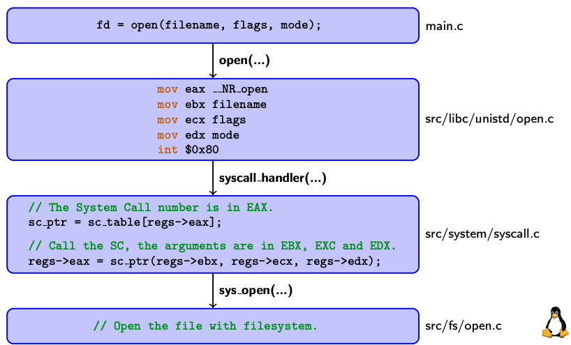

+++
title = "Lezione 7.B - System Call MentOS"
slug = "7-b-mentos-system-call"
description = "Come implementare le system call su MentOS."
date = 2022-04-26
+++

### Preparazione per l'esercitazione

1. Salva il tuo lavoro! Esempio: `MentOS/src/process/scheduler_algorithm.c`.
2. Ripristina la repo di lavoro, riportandola allo stato originale con `git reset --hard`.
3. Aggiorna la repo di lavoro con `git pull`
4. Cambia branch di git utilizzando `git checkout --track origin/feature/Feature-DeadlockEsercise`.

## System Call

### Ingredienti

Gli ingredienti sono:
* una funzione kernel-side
* una funzione user-side
* un numero univoco associato alla system call

Per esempio:

* funzione kernel-side `int sys_open(const char *pathname, int flags, mode t mode);`
* funzione user-side `int open(const char *pathname, int flags, mode t mode);`
* numero univoco associato alla system call `#define __NR_open 5`

### Struttura delle cartelle per l'esercizio

`inc/sys/unistd.h`
* Il file che definisce le system call user-side
* Nell'esempio, il file contiene la funzione open()

`src/libc/unistd/*.c`
* I file implementano le system call user-side
* In pratica, preparano gli argomenti per la system call di sistema e chiamano l'interrupt 80
* La open è implementata all'interno src/libc/unistd/open.c

`inc/system/syscall_types.h`
* contiene la lista dei numeri di system call
* nell'esempio: `#define __NR_open 5`

### Come funzionano su MentOS

### Due esempi di system call

Preparare i registri è un'operazione semplice grazie ad alcune macro (`DEF_SYSCALLN` dove `N` è il numero di parametri da passare alle syscall).

Esempio con la `open` (3 parametri da passare):

int open(const char *pathname, int flags, mode_t mode) {
	ssize_t retval;
	DEFN_SYSCALL3(retval, __NR_open, pathname, flags, mode);
	if (retval < 0)
		errno = -retval, retval = -1;
	return retval;
}


Esempio con la `close` (1 parametro da passare):

int close(int fd) {
	int retval;
	DEFN_SYSCALL1(retval, __NR_close, fd);
	if (retval < 0)
		errno = -retval, retval = -1;
	return retval;
}


### Come posso aggiungere una nuova system call a MentOS?

Assumiamo di avere le seguenti funzioni kernel-side implementate nei file `inc/experimental/smart_sem_kernel.h,`, `src/experimental/smart_sem_kernel.c`.

* `int sys_sem_create();` creazione di un semaforo.
* `int sys_sem_destroy(int id)` distruzione di un semaforo.
* `int sys_sem_init(int id)` inizializzazione di un semaforo
* `int sys_sem_try_acquire(int id)` tenta un'aquisizione di un semaforo identificato da un ID, e se disponibile, ne prende il possesso
* `int sys_sem_release(int id)` rilascia il possesso di un semaforo

Assumiamo inoltre che abbiamo definito le seguenti funzioni user-side (ma **vuote**)

* `int sem_create();`
* `int sem_destroy(int id);`
* `int sem_init(int id);`
* `int sem_acquire(int id);`
* `int sem_release(int id);`

Per aggiungere nuove system call, dobbiamo eseguire i seguenti passaggi.

1. Apri il file `inc/system/syscall_types.h` e scegli un numero per la tua system call:
`#define __NR_sem... 190`
2. Apri il file `src/system/syscall.c` e registra/associa la tua system call e il suo numero all'interno della system call table
`sys_call_table[__NR_sem_ ...] = (SystemCall)sys_sem_...;`
3. Apri il file `src/experimental/smart_sem_user.c` e riempi le system call definite a lato utente (prendendo ispirazioni con le altre system call definite a livello utente). Scrivi le system call utilizzando le macro!

Presta attenzione ai nomi delle funzioni che chiami! Il prefisso `sys` indica una syscall definita a lato kernel.